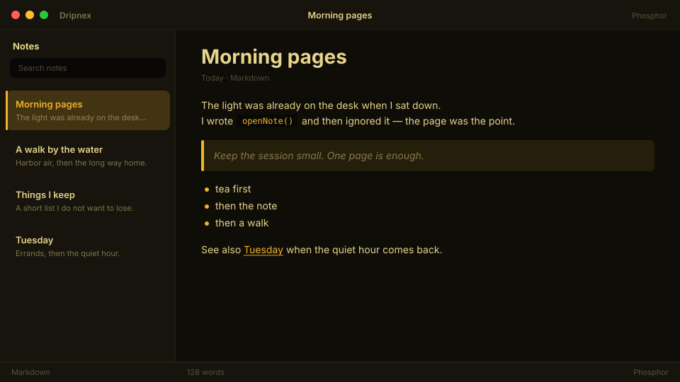

# Phosphor

Amber CRT glow after midnight. Terminal warmth, not a screensaver.



```
dripnex/theme-phosphor
```

## Palette

The chips live in [palette.html](palette.html) — open it in a browser. GitHub won’t paint HTML swatches here, so the hex list is below.

| Name | Token | Color | What it’s for |
| --- | --- | --- | --- |
| Base | `--bg-base` | `#0e0d08` | Window background |
| Surface | `--bg-surface` | `#16140c` | Sidebar and chrome |
| Elevated | `--bg-elevated` | `#1f1c12` | Raised panels |
| Text | `--text-primary` | `#e8d48a` | Headings and body |
| Muted | `--text-muted` | `#e8d48a · rgba(232, 212, 138, 0.5)` | Secondary copy |
| Accent | `--accent` | `#f0b429` | Selection and links |
| Active | `--status-active` | `#f0b429` | Active status |
| Dropped | `--status-dropped` | `#e46876` | Dropped status |

Pick it for amber-terminal nights, not matrix green.
